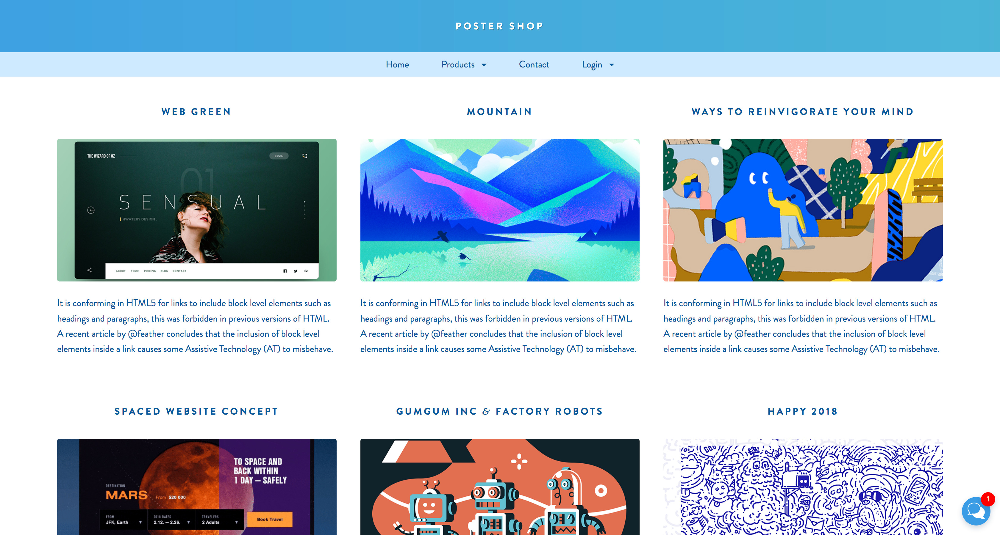

# CSS to the Rescue
**Please use Google Chrome for this demo.**</br>
The website can be found [*here*](https://jamerrone.github.io/cssttr/).</br></br>


## Project Information
For the "CSS to the Rescue" project, we had to design and code a website using prebuild HTML components. We had a lot of strange challenges and limitations. For example, we were not allowed to change the given HTML or make use of JavaScript, classes, and indexes.

As frontend developers, we normally try to build web applications or websites that support a large number of devices and people. However, for this project, we had to design a website exclusive for Marijn. Here is the catch, Marijn does *NOT* use his mouse in order to navigate through website pages, he actually only uses his keyboard.

Another point of interest was the fact that we had to build an as pleasurable experience as possible, this meant going beyond functionality and making use of crazy animations and transitions. In other words, having **FUN** while learning new stuff!

Here are some crazy CSS selectors I had to come up with in order to compensate the lack of classes and indexes:

```
*[id^="outline"]:target {
  ...
}

body > footer progress[value]::-webkit-progress-value {
  ...
}

nav ul a:hover:not(:only-child)::after,
nav ul a:focus:not(:only-child)::after {
  ...
}

nav ul form input[type="checkbox"]:focus + label::before {
  ...
}

aside li:nth-of-type(odd) > p {
  ...
}
```

## Progress
| Components | [*CSS Secrets by Michailia Verou.*](http://shop.oreilly.com/product/0636920031123.do): Hacks & Tricks |
| --------------------------- | --------------------------------------------------------------- |
| - [x] Chat                  | - [x] Fancy ampersands — 5.25                                    |
| - [x] Login                 | - [x] De-emphasize by dimming — 6.32                             |
| - [x] Media Item            | - [x] De-emphasize by blurring — 6.33                            |
| - [x] Navigation            | - [x] Vertical Centering — 7.40                                  |
| - [x] Picture with Subtitle | - [x] Loading spinner — 8.43                                     |
| - [x] Rating                | - [x] Transitions op :hovers en :focus—8.42                     |
| - [x] Step Indicator        | - [x] Cursor—6.29                                               |
|                             | - [x] Extending the clickable area—6.30                         |
|                             | - [x] Custom checkboxes—6.31                                    |
|                             | - [x] (Pseudo)random background—2.7                             |
|                             | - [x] [*Form Validation*](https://codepen.io/joostf/pen/VKyPxk) |

## Known Issues:

#### Safari & Firefox Mobile
- Strange animation bug on the smiley faces.

#### Firefox
- Fieldset Legend does not center with text-align: center.
- Radio/Label does not keep focus permanently.
- Slow/Bad Performance.

#### Chrome
- None